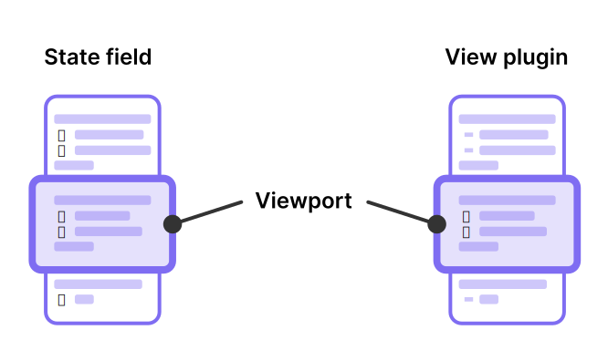

# 장식(Decorations)

장식은 [편집기 확장](index.md)에서 콘텐츠를 그리거나 스타일을 변경하는 데 사용됩니다. 편집기에서 요소를 추가, 대체 또는 스타일링하여 외관을 변경하려는 경우, 장식을 사용해야 할 가능성이 높습니다.

이 페이지의 마지막까지 진행하면 다음을 수행할 수 있게 됩니다.

-   장식을 사용하여 편집기 외관을 변경하는 방법 이해하기.
-   상태 필드와 뷰 플러그인을 사용하여 장식 제공 사이의 차이점 이해하기.

:::note
이 페이지는 Obsidian 플러그인 개발자를 위한 공식 CodeMirror 6 문서를 단순화한 내용입니다. 상태 필드에 대한 자세한 정보는 [문서 꾸미기](https://codemirror.net/docs/guide/#decorating-the-document)를 참조하세요.
:::

## 전제 조건

-   [상태 필드](state-fields.md)에 대한 기본적인 이해.
-   [뷰 플러그인](view-plugins.md)에 대한 기본적인 이해.

## 개요

장식 없이 문서가 일반 텍스트로 렌더링됩니다. 매우 흥미롭지 않습니다. 장식을 사용하면 문서를 표시하는 방식을 변경할 수 있습니다. 예를 들어, 텍스트를 강조하거나 사용자 정의 HTML 요소를 추가할 수 있습니다.

다음 유형의 장식을 사용할 수 있습니다:

-   [마크 장식](https://codemirror.net/docs/ref/#view.Decoration%5Emark)은 기존 요소에 스타일을 적용합니다.
-   [위젯 장식](https://codemirror.net/docs/ref/#view.Decoration%5Ewidget)은 문서에 요소를 삽입합니다.
-   [대체 장식](https://codemirror.net/docs/ref/#view.Decoration%5Ereplace)은 문서의 일부를 숨기거나 다른 요소로 대체합니다.
-   [줄 장식](https://codemirror.net/docs/ref/#view.Decoration%5Eline)은 문서 자체가 아닌 줄에 스타일을 추가합니다.

장식을 사용하려면 편집기 확장 내에서 생성한 후, 확장이 편집기에 *제공*해야 합니다. 상태 필드 또는 뷰 플러그인을 사용하여 편집기에 장식을 제공할 수 있습니다.

## 뷰 플러그인과 상태 필드 중 어느 것을 사용해야 할까요?

뷰 플러그인과 상태 필드 모두 장식을 제공할 수 있지만, 일부 차이점이 있습니다.

-   뷰 플러그인은 [뷰포트](viewport.md) 내용을 기반으로 장식을 결정할 수 있는 경우 사용합니다.
-   상태 필드는 뷰포트 외부에서 장식을 관리해야 할 때 사용합니다.
-   뷰포트 내용과 관계없이 장식을 관리하려면 상태 필드를 사용하세요.
-   줄 바꿈과 같은 변경 사항으로 인해 뷰포트의 내용이 변경될 수 있는 경우에도 상태 필드를 사용하세요.

두 가지 접근 방식 중 하나로 확장을 구현할 수 있다면, 일반적으로 뷰 플러그인이 성능 면에서 우수한 결과를 제공합니다. 예를 들어, 문서의 맞춤법을 검사하는 편집기 확장을 구현하려고 한다고 가정해보겠습니다.

첫 번째 방법은 전체 문서를 외부 맞춤법 검사기에 전달하고, 맞춤법 오류 목록을 반환하는 것입니다. 이 경우, 각 오류를 장식으로 매핑하고 현재 뷰포트에 관계없이 장식을 관리하기 위해 상태 필드를 사용해야 합니다.

두 번째 방법은 보이는 부분만 맞춤법 검사하는 것입니다. 사용자가 문서를 스크롤할 때마다 지속적으로 맞춤법 검사를 실행해야 하지만, 수백만 줄의 텍스트가 있는 문서도 맞춤법 검사할 수 있습니다.



## 장식 제공하기

글머리 기호 목록 항목을 이모지로 대체하는 편집기 확장을 구축하려고 한다고 상상해보겠습니다. 뷰 플러그인과 상태 필드 양쪽의 확장을 사용하여 구현하는 방법을 살펴보겠습니다.

두 가지 구현은 동일한 핵심 로직을 공유합니다:

1. [syntaxTree](https://codemirror.net/docs/ref/#language.syntaxTree)를 사용하여 목록 항목을 찾습니다.
2. 각 목록 항목에 대해 선행 하이픈 `-`을 위젯으로 대체합니다.

### 위젯

위젯은 편집기에 추가할 수 있는 사용자 정의 HTML 요소입니다. 문서의 특정 위치에 위젯을 삽입하거나 내용 일부를 위젯으로 대체할 수 있습니다.

다음 예제는 `<span>👉</span>` HTML 요소를 반환하는 위젯을 정의합니다. 이 위젯은 나중에 사용됩니다.

```ts
import { EditorView, WidgetType } from "@codemirror/view";

export class EmojiWidget extends WidgetType {
    toDOM(view: EditorView): HTMLElement {
        const div = document.createElement("span");

        div.innerText = "👉";

        return div;
    }
}
```

문서의 일부 내용을 이모지 위젯으로 대체하려면 [replace 장식](https://codemirror.net/docs/ref/#view.Decoration%5Ereplace)을 사용하세요.

```ts
const decoration = Decoration.replace({
    widget: new EmojiWidget(),
});
```

### 상태 필드

상태 필드에서 장식을 제공하려면 다음 단계를 따르세요:

1. `DecorationSet` 유형과 함께 [상태 필드 정의](state-fields.md#defining-a-state-field)하기.
2. 상태 필드에 `provide` 속성 추가하기.

    ```ts
    provide(field: StateField<DecorationSet>): Extension {
      return EditorView.decorations.from(field);
    },
    ```

```ts title="field.ts"
import { syntaxTree } from "@codemirror/language";
import {
    Extension,
    RangeSetBuilder,
    StateField,
    Transaction,
} from "@codemirror/state";
import {
    Decoration,
    DecorationSet,
    EditorView,
    WidgetType,
} from "@codemirror/view";
import { EmojiWidget } from "emoji";

export const emojiListField = StateField.define<DecorationSet>({
    create(state): DecorationSet {
        return Decoration.none;
    },
    update(oldState: DecorationSet, transaction: Transaction): DecorationSet {
        const builder = new RangeSetBuilder<Decoration>();

        syntaxTree(transaction.state).iterate({
            enter(node) {
                if (node.type.name.startsWith("list")) {
                    // '-' 또는 '*'의 위치.
                    const listCharFrom = node.from - 2;

                    builder.add(
                        listCharFrom,
                        listCharFrom + 1,
                        Decoration.replace({
                            widget: new EmojiWidget(),
                        })
                    );
                }
            },
        });

        return builder.finish();
    },
    provide(field: StateField<DecorationSet>): Extension {
        return EditorView.decorations.from(field);
    },
});
```

### 뷰 플러그인

뷰 플러그인을 사용하여 장식을 관리하려면 다음 단계를 따르세요:

1. [뷰 플러그인 생성](view-plugins.md#creating-a-view-plugin)하기.
2. 플러그인에 `DecorationSet` 멤버 속성 추가하기.
3. `constructor()`에서 장식 초기화하기.
4. `update()`에서 장식 다시 빌드하기.

모든 업데이트가 장식을 다시 빌드할 이유는 아닙니다. 다음 예제에서는 기본 문서나 뷰포트가 변경될 때만 장식을 다시 빌드합니다.

```ts title="plugin.ts"
import { syntaxTree } from "@codemirror/language";
import { RangeSetBuilder } from "@codemirror/state";
import {
  Decoration,
  DecorationSet,
  EditorView,
  PluginSpec,
  PluginValue,
  ViewPlugin,
  ViewUpdate,
  WidgetType,
} from "@codemirror/view";
import { EmojiWidget } from "emoji";

class EmojiListPlugin implements PluginValue {
  decorations: DecorationSet;

  constructor(view: EditorView) {
    this.decorations = this.buildDecorations(view);
  }

  update(update: ViewUpdate) {
    if (update.docChanged || update.viewportChanged) {
      this.decorations = this.buildDecorations(update.view);
    }
  }

  destroy() {}

  buildDecorations(view: EditorView): DecorationSet {
    const builder = new RangeSetBuilder<Decoration>();

    for (let { from, to } of view.visibleRanges) {
      syntaxTree(view.state).iterate({
        from,
        to,
        enter(node) {
          if (node.type.name.startsWith("list")) {
            // '-' 또는 '*'의 위치.
            const listCharFrom = node.from - 2;

            builder.add(
              listCharFrom,
              listCharFrom +1 ,
              Decoration.replace({
                widget: new EmojiWidget(),
              })
            );
          }
        },
      });
    }

    return builder.finish();
}

const pluginSpec: PluginSpec<EmojiListPlugin> = {
   decorations: (value: EmojiListPlugin) => value.decorations,
};

export const emojiListPlugin = ViewPlugin.fromClass(
  EmojiListPlugin,
  pluginSpec
);
```

`buildDecorations()`은 편집기 뷰를 기반으로 완전한 장식 세트를 작성하는 도우미 메서드입니다.

`ViewPlugin.fromClass()` 함수의 두 번째 인수에 주목하세요. `PluginSpec`에서 `decorations` 속성은 뷰 플러그인이 편집기에 장식을 제공하는 방법을 지정합니다.

뷰 플러그인은 사용자가 볼 수 있는 내용을 알고 있으므로, `view.visibleRanges`를 사용하여 방문할 구문 트리의 일부를 제한할 수 있습니다.
