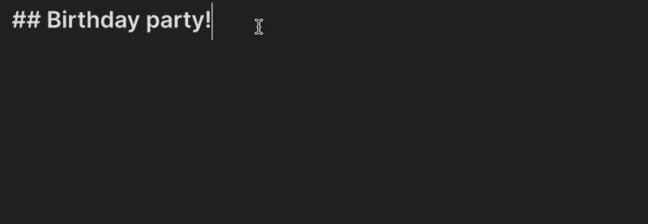

# 편집기

[`Editor`](../reference/typescript/classes/Editor.md) 클래스는 편집 모드에서 활성화된 Markdown 문서를 읽고 조작하는 작업을 제공합니다.

만약 명령어에서 편집기에 접근하려면, [editorCallback](../user-interface/commands.md#editor-commands)을 사용하세요.

다른 곳에서 편집기를 사용하려면, 활성 뷰에서 접근할 수 있습니다:

```ts
const view = this.app.workspace.getActiveViewOfType(MarkdownView);

// 사용자가 Markdown 파일을 편집 중인지 확인합니다.
if (view) {
    // highlight-next-line
    const cursor = view.editor.getCursor();

    // ...
}
```

:::note
Obsidian은 백그라운드로 [CodeMirror](https://codemirror.net/) (CM)를 사용하여 기본 텍스트 편집기로 사용하며, CodeMirror 에디터를 API의 일부로 노출시킵니다. `Editor`는 CM5(데스크탑)와 CM6(모바일)의 기능을 연결하는 추상화 역할을 합니다. CodeMirror 인스턴스에 직접 액세스하는 대신 `Editor`를 사용함으로써, 플러그인이 두 플랫폼 모두에서 작동되도록 보장할 수 있습니다.
:::

## 커서 위치에 텍스트 삽입하기

[`replaceRange()`](../reference/typescript/classes/Editor.md#replacerange) 메서드는 두 커서 위치 사이의 텍스트를 대체합니다. 하나의 위치만 제공하면, 새로운 텍스트를 해당 위치와 다음 위치 사이에 삽입합니다.

다음 명령은 오늘 날짜를 커서 위치에 삽입합니다:

```ts title="main.ts"
import { Editor, moment, Plugin } from "obsidian";

export default class ExamplePlugin extends Plugin {
    async onload() {
        this.addCommand({
            id: "insert-todays-date",
            name: "Insert today's date",
            editorCallback: (editor: Editor) => {
                // highlight-next-line
                editor.replaceRange(
                    moment().format("YYYY-MM-DD"),
                    editor.getCursor()
                );
            },
        });
    }
}
```


## 현재 선택 영역 대체하기

선택된 텍스트를 수정하려면 [`replaceSelection()`](../reference/typescript/classes/Editor.md#replaceselection)을 사용하여 현재 선택 영역을 새로운 텍스트로 대체할 수 있습니다.

다음 명령은 현재 선택된 텍스트를 대문자로 변환합니다:

```ts title="main.ts"
import { Editor, Plugin } from "obsidian";

export default class ExamplePlugin extends Plugin {
    async onload() {
        this.addCommand({
            id: "convert-to-uppercase",
            name: "Convert to uppercase",
            editorCallback: (editor: Editor) => {
                // highlight-start
                const selection = editor.getSelection();
                editor.replaceSelection(selection.toUpperCase());
                // highlight-end
            },
        });
    }
}
```


