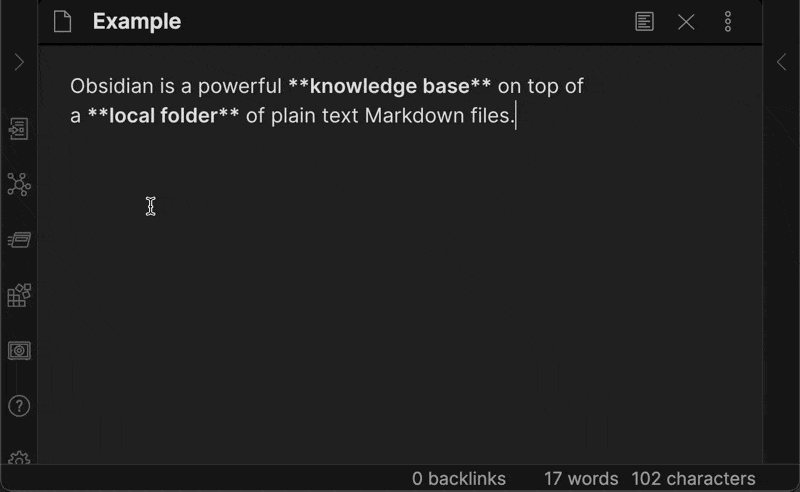

# 링크 삽입

이 예제는 Markdown 링크를 삽입하는 모달을 열 수 있는 명령을 추가합니다. 이 예제는 현재 선택한 텍스트를 기본 링크 텍스트로 설정하고, 사용자가 링크를 삽입할 때 선택한 부분을 대체합니다.

이 예제는 [명령](../user-interface/commands.md), [모달](../user-interface/modals.md) 및 [에디터](../editor/index.md)에 대한 지식을 전제로 합니다. 이 예제를 이해하기 어렵다면, 계속하기 전에 해당 가이드를 참조하세요.

다음은 만들어볼 내용입니다:



전체 소스 코드는 다음과 같습니다:

```ts title="main.ts"
import { Editor, Plugin } from "obsidian";
import { InsertLinkModal } from "./modal";

export default class InsertLinkPlugin extends Plugin {
    async onload() {
        this.addCommand({
            id: "insert-link",
            name: "링크 삽입",
            editorCallback: (editor: Editor) => {
                const selectedText = editor.getSelection();

                const onSubmit = (text: string, url: string) => {
                    editor.replaceSelection(`[${text}](${url})`);
                };

                new InsertLinkModal(this.app, selectedText, onSubmit).open();
            },
        });
    }
}
```

```ts title="modal.ts"
import { App, Modal, Setting } from "obsidian";

export class InsertLinkModal extends Modal {
    linkText: string;
    linkUrl: string;

    onSubmit: (linkText: string, linkUrl: string) => void;

    constructor(
        app: App,
        defaultLinkText: string,
        onSubmit: (linkText: string, linkUrl: string) => void
    ) {
        super(app);
        this.linkText = defaultLinkText;
        this.onSubmit = onSubmit;
    }

    onOpen() {
        const { contentEl } = this;

        contentEl.createEl("h1", { text: "Insert link" });

        new Setting(contentEl).setName("Link text").addText((text) =>
            text.setValue(this.linkText).onChange((value) => {
                this.linkText = value;
            })
        );

        new Setting(contentEl).setName("Link URL").addText((text) =>
            text.setValue(this.linkUrl).onChange((value) => {
                this.linkUrl = value;
            })
        );

        new Setting(contentEl).addButton((btn) =>
            btn
                .setButtonText("Insert")
                .setCta()
                .onClick(() => {
                    this.close();
                    this.onSubmit(this.linkText, this.linkUrl);
                })
        );
    }

    onClose() {
        let { contentEl } = this;
        contentEl.empty();
    }
}
```
