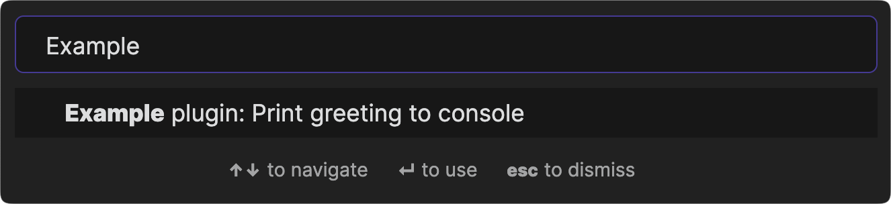

# 명령어

명령어는 사용자가 [명령 팔레트](https://help.obsidian.md/Plugins/Command+palette) 또는 단축키를 사용하여 수행할 수 있는 작업입니다.



플러그인에 새 명령을 등록하려면 `onload()` 메서드 내에서 [`addCommand()`](../reference/typescript/classes/Plugin_2.md#addcommand) 메서드를 호출하세요:

```ts title="main.ts"
import { Plugin } from "obsidian";

export default class ExamplePlugin extends Plugin {
    async onload() {
        // highlight-start
        this.addCommand({
            id: "print-greeting-to-console",
            name: "Print greeting to console",
            callback: () => {
                console.log("Hey, you!");
            },
        });
        // highlight-end
    }
}
```

## 조건부 명령어

명령이 특정 조건에서만 실행 가능한 경우 [`checkCallback`](../reference/typescript/interfaces/Command.md#checkcallback)을 사용하는 것이 좋습니다.

`checkCallback`은 두 번 실행됩니다. 먼저 명령이 실행 가능한지 여부를 결정하기 위한 예비 확인을 수행합니다. 그런 다음 작업을 수행하기 위해 두 번째로 실행됩니다.

두 실행 사이에 시간이 경과할 수 있으므로 콜백에서 두 번 모두 확인을 수행해야 합니다.

다음 예제의 명령은 필수 값에 의존합니다. 두 실행에서 콜백은 값이 있는지 확인하고 `checking`이 `false`일 때만 작업을 수행합니다.

```ts
this.addCommand({
    id: "example-command",
    name: "Example command",
    // highlight-next-line
    checkCallback: (checking: boolean) => {
        const value = getRequiredValue();

        if (value) {
            if (!checking) {
                doCommand(value);
            }

            return true;
        }

        return false;
    },
});
```

## 편집기 명령어

명령이 편집기에 액세스해야 하는 경우 [`editorCallback`](../reference/typescript/interfaces/Command.md#editorcallback)을 사용할 수도 있으며, 이 콜백은 활성 편집기와 해당 보기를 인수로 받습니다.

```ts
this.addCommand({
    id: "example-command",
    name: "Example command",
    // highlight-next-line
    editorCallback: (editor: Editor, view: MarkdownView) => {
        const sel = editor.getSelection();

        console.log(`You have selected: ${sel}`);
    },
});
```

:::note
편집기 명령은 활성 편집기가 있는 경우에만 명령 팔레트에 나타납니다.
:::

편집기 콜백이 특정 조건에서만 실행되어야 하는 경우 [`editorCheckCallback`](../reference/typescript/interfaces/Command.md#editorcheckcallback)을 사용하세요. 자세한 내용은 [조건부 명령](#조건부-명령어)를 참조하세요.

```ts
this.addCommand({
    id: "example-command",
    name: "Example command",
    // highlight-next-line
    editorCheckCallback: (
        checking: boolean,
        editor: Editor,
        view: MarkdownView
    ) => {
        const value = getRequiredValue();

        if (value) {
            if (!checking) {
                doCommand(value);
            }

            return true;
        }

        return false;
    },
});
```

## 단축키

사용자는 키보드 단축키 또는 *단축키*를 사용하여 명령을 실행할 수 있습니다. 사용자는 이를 직접 구성할 수 있지만, 기본 단축키를 제공할 수도 있습니다.

:::경고
다른 사람이 사용하도록 의도한 플러그인에 기본 단축키를 설정하는 것을 피하세요. 단축키는 다른 플러그인이나 사용자 스스로 정의한 단축키와 충돌할 가능성이 높습니다.
:::

다음 예에서 사용자는 Ctrl (또는 Mac의 경우 Cmd)와 Shift를 함께 누른 다음 키보드의 `a` 키를 눌러 명령을 실행할 수 있습니다.

```ts
this.addCommand({
    id: "example-command",
    name: "Example command",
    // highlight-next-line
    hotkeys: [{ modifiers: ["Mod", "Shift"], key: "a" }],
    callback: () => {
        console.log("Hey, you!");
    },
});
```

:::note
Mod 키는 특수한 수정자 키로, Windows 및 Linux에서는 Ctrl로, macOS에서는 Cmd로 대체됩니다.
:::
