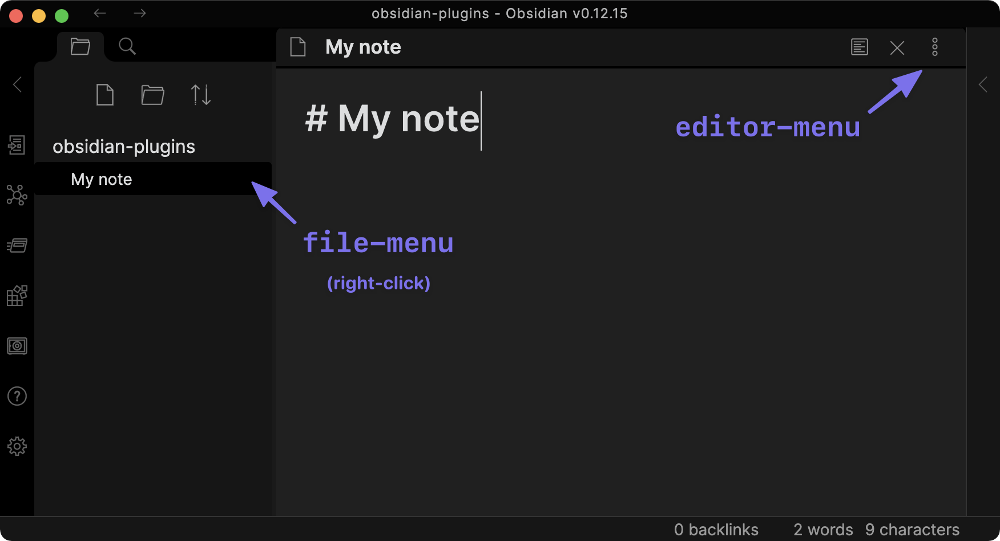

# 컨텍스트 메뉴

컨텍스트 메뉴를 열고 싶다면 [`Menu`](../reference/typescript/classes/Menu.md)를 사용하세요:

```ts
import { Menu, Notice, Plugin } from "obsidian";

export default class ExamplePlugin extends Plugin {
    async onload() {
        this.addRibbonIcon("dice", "메뉴 열기", (event) => {
            // highlight-start
            const menu = new Menu(this.app);

            menu.addItem((item) =>
                item
                    .setTitle("복사")
                    .setIcon("documents")
                    .onClick(() => {
                        new Notice("복사됨");
                    })
            );

            menu.addItem((item) =>
                item
                    .setTitle("붙여넣기")
                    .setIcon("paste")
                    .onClick(() => {
                        new Notice("붙여넣기됨");
                    })
            );

            menu.showAtMouseEvent(event);
            // highlight-end
        });
    }
}
```

[`showAtMouseEvent()`](../reference/typescript/classes/Menu.md#showatmouseevent)는 마우스로 클릭한 위치에 메뉴를 엽니다.

:::팁
메뉴가 나타날 위치를 더 정확하게 제어해야 하는 경우, `menu.showAtPosition({ x: 20, y: 20 })`을 사용하여 메뉴를 Obsidian 창의 좌측 상단 모서리를 기준으로 한 위치에 열 수 있습니다.
:::

사용 가능한 아이콘에 대한 자세한 정보는 [Icons](icons.md)를 참조하세요.

또한 `file-menu` 및 `editor-menu` 워크스페이스 이벤트를 구독하여 파일 메뉴나 편집기 메뉴에 항목을 추가할 수도 있습니다:



```ts
import { Notice, Plugin } from "obsidian";

export default class ExamplePlugin extends Plugin {
    async onload() {
        this.registerEvent(
            this.app.workspace.on("file-menu", (menu, file) => {
                menu.addItem((item) => {
                    item.setTitle("파일 경로 출력 👈")
                        .setIcon("document")
                        .onClick(async () => {
                            new Notice(file.path);
                        });
                });
            })
        );

        this.registerEvent(
            this.app.workspace.on("editor-menu", (menu, editor, view) => {
                menu.addItem((item) => {
                    item.setTitle("파일 경로 출력 👈")
                        .setIcon("document")
                        .onClick(async () => {
                            new Notice(view.file.path);
                        });
                });
            })
        );
    }
}
```

이벤트 처리에 대한 자세한 내용은 [Events](../events.md)를 참조하세요.
