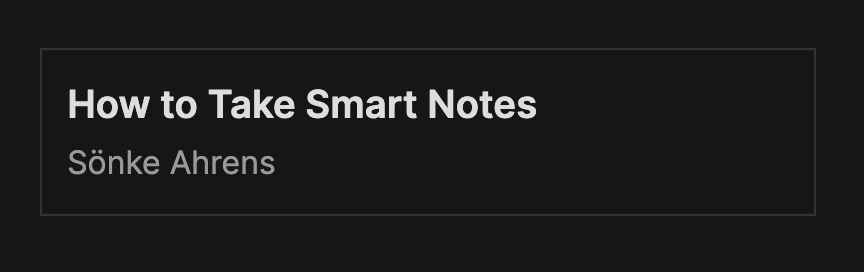

# HTML 요소

Obsidian API의 여러 구성 요소, 예를 들어 [설정 탭](settings.md) 등은 *컨테이너 요소*를 노출시킵니다:

```ts
import { App, PluginSettingTab } from "obsidian";

class ExampleSettingTab extends PluginSettingTab {
    plugin: ExamplePlugin;

    constructor(app: App, plugin: ExamplePlugin) {
        super(app, plugin);
        this.plugin = plugin;
    }

    display(): void {
        // highlight-next-line
        let { containerEl } = this;

        // ...
    }
}
```

컨테이너 요소는 Obsidian 내에서 사용자 정의 인터페이스를 만들 수 있게 해주는 `HTMLElement` 객체입니다.

## `createEl()`을 사용하여 HTML 요소 생성하기

컨테이너 요소를 포함하여 모든 `HTMLElement`는 원본 요소 아래에 `HTMLElement`를 만드는 `createEl()` 메서드를 노출합니다.

예를 들어, 컨테이너 요소 내부에 `<h1>` 제목 요소를 추가하는 방법은 다음과 같습니다:

```ts
containerEl.createEl("h1", { text: "Heading 1" });
```

`createEl()`은 새 요소에 대한 참조를 반환합니다:

```ts
const book = containerEl.createEl("div");
book.createEl("div", { text: "How to Take Smart Notes" });
book.createEl("small", { text: "Sönke Ahrens" });
```

## 요소에 스타일 추가하기

플러그인에서 사용자 정의 CSS 스타일을 추가하려면 플러그인 루트 디렉터리에 `styles.css` 파일을 추가하세요. 이전 예제에서 책을 위한 일부 스타일을 추가하는 방법은 다음과 같습니다:

```css title="styles.css"
.book {
    border: 1px solid var(--background-modifier-border);
    padding: 10px;
}

.book__title {
    font-weight: 600;
}

.book__author {
    color: var(--text-muted);
}
```

:::팁
`--background-modifier-border` 및 `--text-muted`는 Obsidian이 정의하고 사용하는 [CSS 변수](https://developer.mozilla.org/en-US/docs/Web/CSS/Using_CSS_custom_properties)입니다. 이러한 변수를 스타일에 사용하면 사용자가 다른 테마를 사용하더라도 플러그인이 멋지게 보입니다! 🌈
:::

HTML 요소에 스타일을 적용하려면 HTML 요소에 `cls` 속성을 설정하세요:

```ts
const book = containerEl.createEl("div", { cls: "book" });
book.createEl("div", { text: "How to Take Smart Notes", cls: "book__title" });
book.createEl("small", { text: "Sönke Ahrens", cls: "book__author" });
```

이제 훨씬 멋져 보입니다! 🎉



### 조건부 스타일

사용자의 설정이나 다른 값에 따라 요소의 스타일을 변경하려면 `toggleClass` 메서드를 사용하세요:

```ts
element.toggleClass("danger", status === "error");
```
