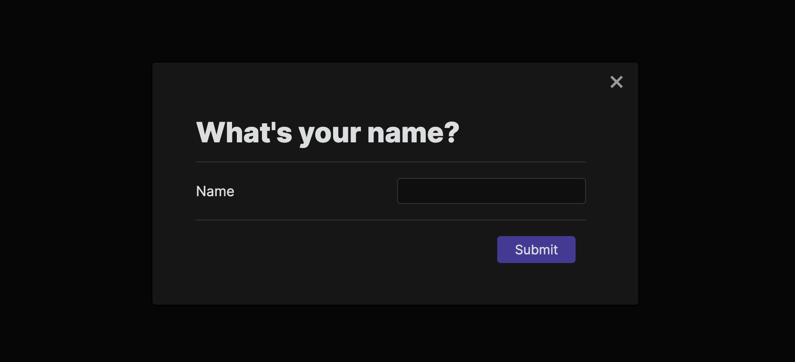
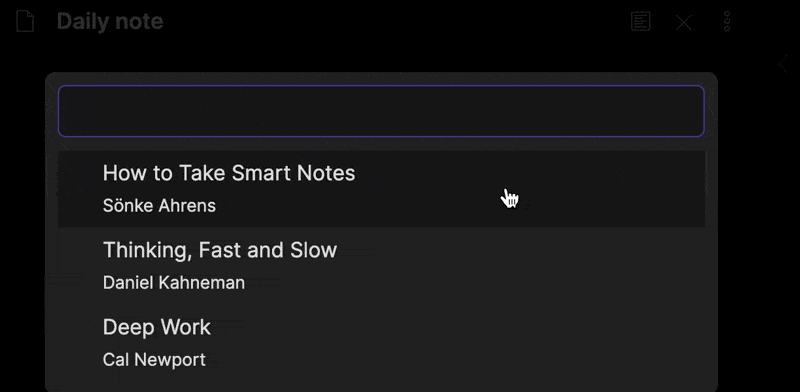
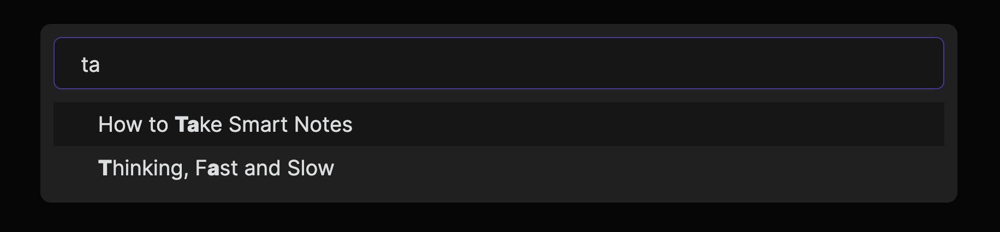

# 모달

모달은 정보를 표시하고 사용자로부터 입력을 받습니다. 모달을 생성하려면 [`Modal`](../reference/typescript/classes/Modal.md)을 확장하는 클래스를 생성합니다:

```ts title="modal.ts"
import { App, Modal } from "obsidian";

export class ExampleModal extends Modal {
    constructor(app: App) {
        super(app);
    }

    onOpen() {
        let { contentEl } = this;
        contentEl.setText("Look at me, I'm a modal! 👀");
    }

    onClose() {
        let { contentEl } = this;
        contentEl.empty();
    }
}
```

-   [`onOpen()`](../reference/typescript/classes/Modal.md#onopen)는 모달이 열릴 때 호출되며 모달의 내용을 구축하는 역할을 합니다. 자세한 정보는 [HTML elements](html-elements.md)를 참조하세요.
-   [`onClose()`](../reference/typescript/classes/Modal.md#onclose)는 모달이 닫힐 때 호출되며 모달에 의해 사용된 어떠한 리소스든 청소하는 역할을 합니다.

모달을 열려면 `ExampleModal`의 새 인스턴스를 생성하고 그것에 [`open()`](../reference/typescript/classes/Modal.md#open) 메서드를 호출합니다:

```ts title="main.ts"
import { Plugin } from "obsidian";
import { ExampleModal } from "./modal";

export default class ExamplePlugin extends Plugin {
    async onload() {
        this.addCommand({
            id: "display-modal",
            name: "Display modal",
            callback: () => {
                new ExampleModal(this.app).open();
            },
        });
    }
}
```

## 사용자 입력 받기

이전 예제에서의 모달은 일부 텍스트만 표시했습니다. 사용자로부터의 입력을 처리하는 조금 더 복잡한 예제를 살펴봅시다.



```ts title="modal.ts"
import { App, Modal, Setting } from "obsidian";

export class ExampleModal extends Modal {
    result: string;
    onSubmit: (result: string) => void;

    constructor(app: App, onSubmit: (result: string) => void) {
        super(app);
        this.onSubmit = onSubmit;
    }

    onOpen() {
        const { contentEl } = this;

        contentEl.createEl("h1", { text: "What's your name?" });

        new Setting(contentEl).setName("Name").addText((text) =>
            text.onChange((value) => {
                // highlight-next-line
                this.result = value;
            })
        );

        new Setting(contentEl).addButton((btn) =>
            btn
                .setButtonText("Submit")
                .setCta()
                .onClick(() => {
                    // highlight-start
                    this.close();
                    this.onSubmit(this.result);
                    // highlight-end
                })
        );
    }

    onClose() {
        let { contentEl } = this;
        contentEl.empty();
    }
}
```

결과는 `this.result`에 저장되고 사용자가 **Submit**을 클릭하면 `onSubmit` 콜백에서 반환됩니다:

```ts
new ExampleModal(this.app, (result) => {
    new Notice(`Hello, ${result}!`);
}).open();
```

## 제안 목록에서 선택하기

[`SuggestModal`](../reference/typescript/classes/SuggestModal.md)은 사용자에게 제안 목록을 표시할 수 있게 해주는 특별한 모달입니다.



```ts title="modal.ts"
import { App, Notice, SuggestModal } from "obsidian";

interface Book {
    title: string;
    author: string;
}

const ALL_BOOKS = [
    {
        title: "How to Take Smart Notes",
        author: "Sönke Ahrens",
    },
    {
        title: "Thinking, Fast and Slow",
        author: "Daniel Kahneman",
    },
    {
        title: "Deep Work",
        author: "Cal Newport",
    },
];

export class ExampleModal extends SuggestModal<Book> {
    // Returns all available suggestions.
    getSuggestions(query: string): Book[] {
        return ALL_BOOKS.filter((book) =>
            book.title.toLowerCase().includes(query.toLowerCase())
        );
    }

    // Renders each suggestion item.
    renderSuggestion(book: Book, el: HTMLElement) {
        el.createEl("div", { text: book.title });
        el.createEl("small", { text: book.author });
    }

    // Perform action on the selected suggestion.
    onChooseSuggestion(book: Book, evt: MouseEvent | KeyboardEvent) {
        new Notice(`Selected ${book.title}`);
    }
}
```

`SuggestModal` 외에도 Obsidian API는 제안을 위한 더욱 특수화된 타입의 모달을 제공합니다: [`FuzzySuggestModal`](../reference/typescript/classes/FuzzySuggestModal.md). 각 항목이 렌더링되는 방식에 대해 동일한 제어를 주지는 않지만, 상자를 벗겨낸 채로 [퍼지 문자열 검색](https://en.wikipedia.org/wiki/Approximate_string_matching)을 얻게 됩니다.



```ts
export class ExampleModal extends FuzzySuggestModal<Book> {
    getItems(): Book[] {
        return ALL_BOOKS;
    }

    getItemText(book: Book): string {
        return book.title;
    }

    onChooseItem(book: Book, evt: MouseEvent | KeyboardEvent) {
        new Notice(`Selected ${book.title}`);
    }
}
```
