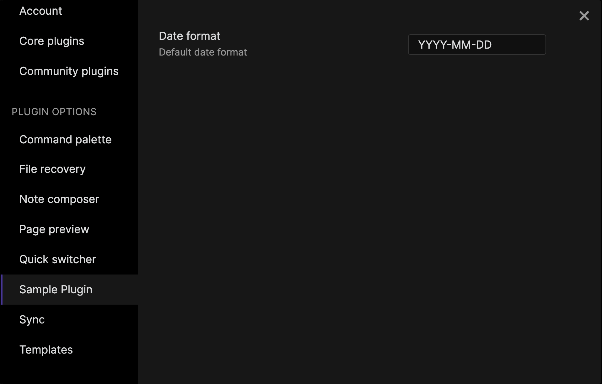

# 설정

사용자가 플러그인의 일부를 직접 구성할 수 있도록 하려면, 이들을 *설정*으로 노출할 수 있습니다.

이 가이드에서는 다음과 같은 설정 페이지를 만드는 방법을 배웁니다 👇



플러그인에 설정을 추가하는 주요 이유는 사용자가 Obsidian을 종료한 후에도 지속되는 구성을 저장하기 위함입니다. 다음 예제는 디스크에서 설정을 저장하고 로드하는 방법을 보여줍니다:

```ts title="main.ts"
import { Plugin } from "obsidian";
import { ExampleSettingTab } from "./settings";

interface ExamplePluginSettings {
    dateFormat: string;
}

const DEFAULT_SETTINGS: Partial<ExamplePluginSettings> = {
    dateFormat: "YYYY-MM-DD",
};

export default class ExamplePlugin extends Plugin {
    settings: ExamplePluginSettings;

    async onload() {
        await this.loadSettings();

        this.addSettingTab(new ExampleSettingTab(this.app, this));
    }

    async loadSettings() {
        this.settings = Object.assign(
            {},
            DEFAULT_SETTINGS,
            await this.loadData()
        );
    }

    async saveSettings() {
        await this.saveData(this.settings);
    }
}
```

여기서 많은 일이 일어나고 있습니다 🤯, 그래서 각 부분을 자세히 살펴봅시다.

## 설정 정의 생성

먼저, `ExamplePluginSettings`라는 정의를 생성하여 사용자가 어떤 설정을 구성할 수 있게 할지 결정해야 합니다. 플러그인이 활성화된 동안에는 `settings` 멤버 변수에서 설정에 접근할 수 있습니다.

```ts
interface ExamplePluginSettings {
    dateFormat: string;
}

export default class ExamplePlugin extends Plugin {
    settings: ExamplePluginSettings;

    // ...
}
```

## 설정 객체 저장 및 로드

[`loadData()`](../reference/typescript/classes/Plugin_2.md#loaddata)와 [`saveData()`](../reference/typescript/classes/Plugin_2.md#savedata)는 디스크에서 데이터를 저장하고 검색하는 간편한 방법을 제공합니다. 이 예제에서는 플러그인의 다른 부분에서 `loadData()`와 `saveData()`를 사용하기 쉽게 하는 두 개의 도우미 메서드를 소개합니다.

```ts
export default class ExamplePlugin extends Plugin {
    // ...

    async loadSettings() {
        this.settings = Object.assign(
            {},
            DEFAULT_SETTINGS,
            await this.loadData()
        );
    }

    async saveSettings() {
        await this.saveData(this.settings);
    }
}
```

마지막으로 플러그인이 로드될 때 설정을 로드해야 합니다:

```ts
async onload() {
  await this.loadSettings();

  // ...
}
```

## 기본값 제공

사용자가 플러그인을 처음 활성화할 때, 아직 어떤 설정도 구성되지 않았습니다. 이전의 예제는 누락된 설정에 대한 기본값을 제공합니다.

이 작동 방식을 이해하기 위해 다음 코드를 살펴봅시다:

```ts
Object.assign({}, DEFAULT_SETTINGS, await this.loadData());
```

`Object.assign()`은 한 객체에서 다른 객체로 모든 속성을 복사하는 JavaScript 함수입니다. `loadData()`에 의해 반환된 어떤 속성이든 `DEFAULT_SETTINGS`의 속성을 덮어씁니다.

```ts
const DEFAULT_SETTINGS: Partial<ExamplePluginSettings> = {
    dateFormat: "YYYY-MM-DD",
};
```

:::tip
`Partial<Type>`은 `Type`의 모든 속성을 선택적으로 설정한 타입을 반환하는 TypeScript 유틸리티입니다. 이를 통해 타입 체크를 활성화하면서 기본값을 제공하려는 속성만 정의할 수 있습니다.
:::

## 설정 탭 등록

이제 플러그인은 플러그인 구성을 저장하고 로드할 수 있지만, 사용자는 아직 설정 중 어떤 것도 변경할 방법이 없습니다. 설정 탭을 추가함으로써 사용자가 플러그인 설정을 업데이트하기 위한 쉽게 사용할 수 있는 인터페이스를 제공할 수 있습니다:

```ts
this.addSettingTab(new ExampleSettingTab(this.app, this));
```

여기서 `ExampleSettingTab`은 [`PluginSettingTab`](../reference/typescript/classes/PluginSettingTab.md)를 확장하는 클래스입니다:

```ts title="settings.ts"
import ExamplePlugin from "./main";
import { App, PluginSettingTab, Setting } from "obsidian";

export class ExampleSettingTab extends PluginSettingTab {
    plugin: ExamplePlugin;

    constructor(app: App, plugin: ExamplePlugin) {
        super(app, plugin);
        this.plugin = plugin;
    }

    display(): void {
        let { containerEl } = this;

        containerEl.empty();

        new Setting(containerEl)
            .setName("Date format")
            .setDesc("Default date format")
            .addText((text) =>
                text
                    .setPlaceholder("MMMM dd, yyyy")
                    .setValue(this.plugin.settings.dateFormat)
                    .onChange(async (value) => {
                        this.plugin.settings.dateFormat = value;
                        await this.plugin.saveSettings();
                    })
            );
    }
}
```

`display()`는 설정 탭의 내용을 구축하는 곳입니다. 자세한 정보는 [HTML elements](html-elements.md)를 참조하세요.

`new Setting(containerEl)`은 컨테이너 요소에 설정을 추가합니다. 이 예제에서는 `addText()`를 사용하여 텍스트 필드를 사용하지만, 사용할 수 있는 다른 여러 설정 유형이 있습니다.

텍스트 필드의 값이 변경될 때마다 설정 객체를 업데이트하고 디스크에 저장합니다:

```ts {2,3}
.onChange(async (value) => {
  // highlight-start
  this.plugin.settings.dateFormat = value;
  await this.plugin.saveSettings();
  // highlight-end
})
```

잘 했습니다! 💪 사용자들은 플러그인과 상호작용하는 방식을 맞춤화할 수 있는 방법을 제공해준 것에 감사할 것입니다. 다음 가이드로 넘어가기 전에 배운 내용으로 다른 설정을 추가해보며 실험해보세요.
