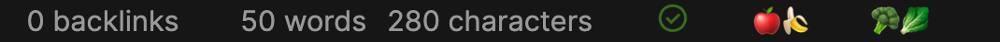

# 상태 바

상태 바에 새로운 블록을 생성하려면, `onload()` 메서드에서 [`addStatusBarItem()`](../reference/typescript/classes/Plugin_2.md#addstatusbaritem)를 호출하세요. `addStatusBarItem()` 메서드는 자신의 요소를 추가할 수 있는 [HTML element](html-elements.md)를 반환합니다.

:::caution Obsidian 모바일
사용자 정의 상태 바 항목은 Obsidian 모바일 앱에서 [지원되지 **않습니다**](https://discord.com/channels/686053708261228577/707816848615407697/832321402106544179).
:::

```ts title="main.ts"
import { Plugin } from "obsidian";

export default class ExamplePlugin extends Plugin {
    async onload() {
        const item = this.addStatusBarItem();
        item.createEl("span", { text: "Hello from the status bar 👋" });
    }
}
```

:::note
`createEl()` 메서드 사용 방법에 대한 자세한 정보는 [HTML elements](html-elements.md)를 참조하세요.
:::

`addStatusBarItem()`을 여러 번 호출하여 여러 개의 상태 바 항목을 추가할 수 있습니다. Obsidian이 이들 사이에 간격을 추가하기 때문에, 간격 조절이 필요하다면 같은 상태 바 항목에 여러 개의 HTML 요소를 생성해야 합니다.

```ts title="main.ts"
import { Plugin } from "obsidian";

export default class ExamplePlugin extends Plugin {
    async onload() {
        const fruits = this.addStatusBarItem();
        fruits.createEl("span", { text: "🍎" });
        fruits.createEl("span", { text: "🍌" });

        const veggies = this.addStatusBarItem();
        veggies.createEl("span", { text: "🥦" });
        veggies.createEl("span", { text: "🥬" });
    }
}
```

위 예시는 다음과 같은 상태 바를 만듭니다:


