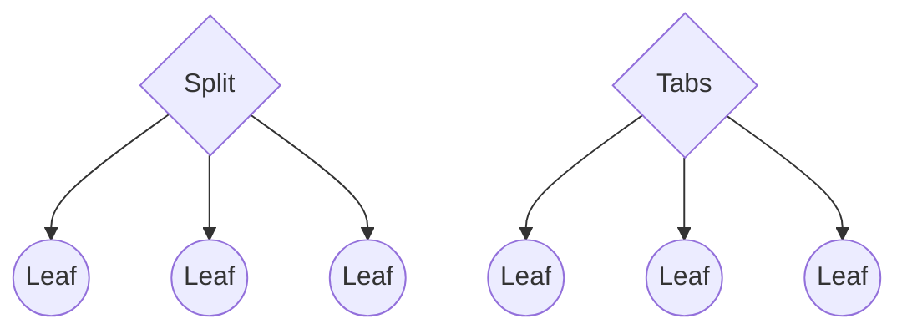
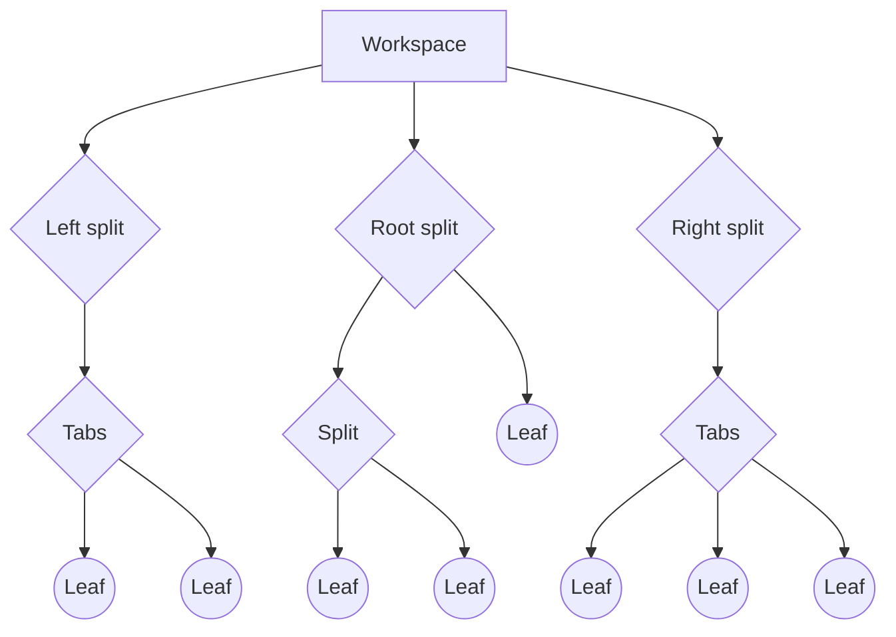
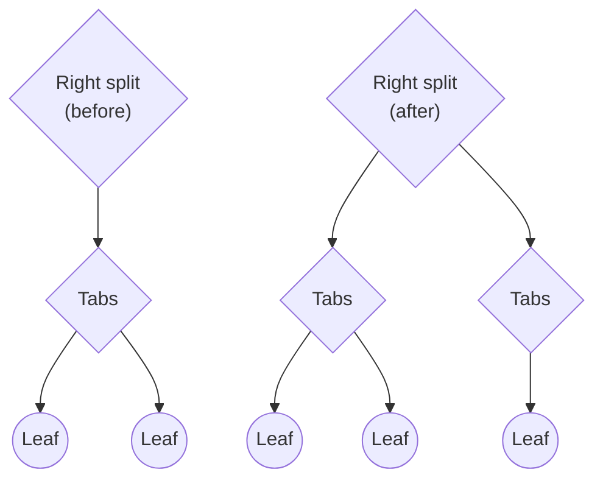

# 작업 공간

Obsidian은 언제든지 보여지는 컨텐츠를 사용자가 설정할 수 있습니다. 필요하지 않을 때 파일 탐색기를 숨기거나, 여러 문서를 나란히 표시하거나, 작업 중인 문서의 개요를 보여줄 수 있습니다. 애플리케이션 창 내에서 보이는 컨텐츠의 구성을 _작업 공간_ 이라고 합니다.

작업 공간은 [트리 데이터 구조](<https://en.wikipedia.org/wiki/Tree_(data_structure)>)로 구현되며, 트리의 각 노드는 [작업 공간 항목](../reference/typescript/classes/WorkspaceItem.md)으로 불립니다. 작업 공간 항목에는 [_부모_](../reference/typescript/classes/WorkspaceParent.md)와 [_잎_](../reference/typescript/classes/WorkspaceLeaf.md)라는 두 가지 유형이 있습니다. 주요 차이점은 부모 항목이 _자식_ 항목(다른 부모 항목 포함)을 포함할 수 있는 반면, 잎 항목은 어떤 작업 공간 항목도 포함하지 않는다는 것입니다.

부모 아이템에는 [_분할_](../reference/typescript/classes/WorkspaceSplit.md)과 [_탭_](../reference/typescript/classes/WorkspaceTabs.md)의 두 가지 유형이 있으며, 이들은 자식들이 사용자에게 어떻게 표시되는지 결정합니다:



-   분할 아이템은 자식 아이템들을 세로 혹은 가로 방향으로 하나씩 배치합니다.
-   탭 아이템은 한 번에 하나의 자식 아이템만 표시하고 다른 것들을 숨깁니다.

작업공간에는 _왼쪽_, _오른쪽_, 그리고 *루트*라는 세 개의 특별한 분할항목들이 있습니다. 다음 다그람은 일반적인 작없공간 모습 예시입니다:



잎(leaf)은 컨텐츠를 다양한 방식으로 표시할 수 있는 창입니다. 잎의 유형은 컨텐츠가 어떻게 표시되는지 결정하며, 특정 *뷰*에 해당합니다. 예를 들어, 'graph' 유형의 잎은 [그래프 뷰](https://help.obsidian.md/Plugins/Graph+view)를 표시합니다.

## 분할

기본적으로, 루트 분할의 방향은 세로로 설정됩니다. 새로운 잎을 만들면, Obsidian은 사용자 인터페이스에 새로운 열을 생성합니다. 잎을 분할하면, 결과적으로 생성된 잎들이 새로운 분할 아이템에 추가됩니다. 루트 분할 아래에서 만들 수 있는 단계 수에는 정해진 제한이 없지만, 실제로는 각 단계마다 그 유용성이 줄어듭니다.

```mermaid
flowchart TD
   rootBefore{"Root split (before)"}

   rootBefore--> leaf1 (( Leaf ))
   rootBefore--> leaf2 (( Leaf ))

   rootAfter {"Root split (after)"}

   rootAfter-->split {Split }
   rootAfter-->leaf3 (( Leaf ))
   split-->leaf4 (( Leaf ))
   split-->leaf5 (( Leaf ))
```

왼쪽과 오른쪽 분할은 약간 다르게 작동합니다. 사이드 독에서 잎을 분할하면 Obsidian은 새 탭 아이템을 생성하고 새 잎을 그 아래에 추가합니다. 실질적으로 이것은 언제든지 작업 공간 항목 세 개만 가질 수 있으며, 직접 자식들은 반드시 탭 항목이어야 한다는 것을 의미합니다.



## 작업 공간 검사하기

[App](../reference/typescript/classes/App.md) 객체를 통해 작업 공간에 접근할 수 있습니다. 다음 예시는 작업 공간의 모든 잎의 유형을 출력합니다:

```ts title="main.ts" {6-8}
import { Plugin } from "obsidian";

export default class ExamplePlugin extends Plugin {
    async onload() {
        this.addRibbonIcon("dice", "Print leaf types", () => {
            this.app.workspace.iterateAllLeaves((leaf) => {
                console.log(leaf.getViewState().type);
            });
        });
    }
}
```

## 잎의 생명주기

플러그인은 어떤 유형의 잎이든 작업 공간에 추가할 수 있으며, [사용자 정의 뷰](views.md)를 통해 새로운 잎 유형을 정의할 수 있습니다. 다음은 몇 가지 방법으로 작업 공간에 잎을 추가하는 방법입니다. 더 많은 방법을 알고 싶다면 [`Workspace`](../reference/typescript/classes/Workspace.md)를 참조하세요.

-   루트 분할에 새로운 잎을 추가하려면 [`workspace.getLeaf(true)`](../reference/typescript/classes/Workspace.md#getleaf)를 사용하세요.
-   사이드바 중 어디서든 새로운 잎을 추가하려면 [`workspace.getLeftLeaf()`](../reference/typescript/classes/Workspace.md#getleftleaf)와 [`workspace.getRightLeaf()`](../reference/typescript/classes/Workspace.md#getrightleaf)를 사용하세요. 이들 모두 새 분할에 잎을 추가할지 여부를 결정하게 합니다.

선택한 분할에서 명시적으로 잎을 추가하려면, [`createLeafInParent()`](../reference/typescript/classes/Workspace.md#createleafinparent)를 사용합니다.

플러그인이 비활성화된 후에도 명시적으로 제거되지 않는 한, 플러그인이 작업 공간에 추가한 모든 잎들은 그대로 남아있습니다. 플러그인은 자신들이 작업 공간에 추가한 모든 잎들을 제거하는 책임이 있습니다.

작업공간에서 한 개의 '잎' 항목 제거하려면, 제거 원하는 '잊' 항목에서 [`detach()`](../reference/typescript/classes/WorkspaceLeaf.md#detach) 호출합니다. 특정 유형의 모든 잎들을 제거하려면, [`detachLeavesOfType()`](../reference/typescript/classes/Workspace.md#detachleavesoftype)를 사용합니다.

## 잎 그룹

[`setGroup()`](../reference/typescript/classes/WorkspaceLeaf.md#setgroup)를 사용하여 여러 잎을 동일한 그룹에 할당함으로써 [연결된 패널](https://help.obsidian.md/User+interface/Workspace/Panes/Linked+pane)을 생성할 수 있습니다.

```ts
leaves.forEach((leaf) => leaf.setGroup("group1");
```
